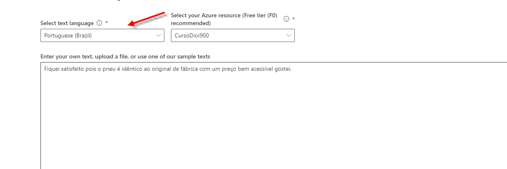
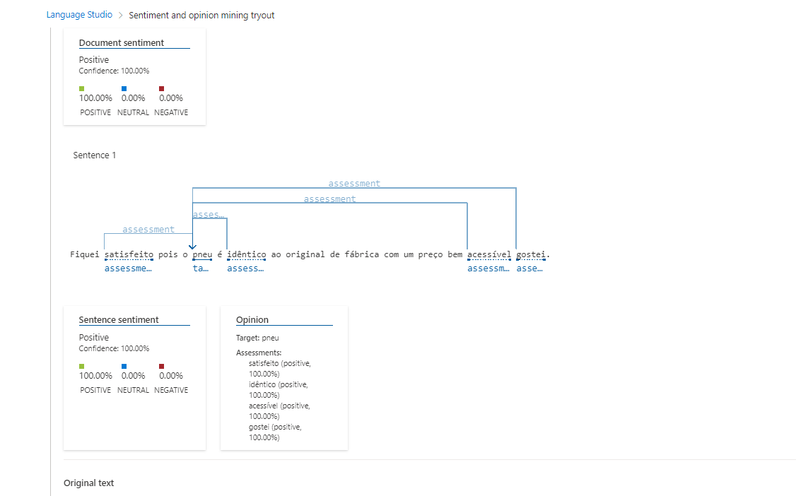
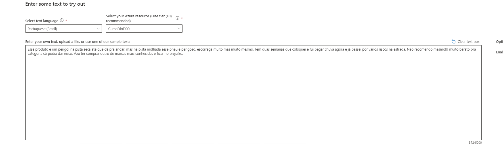
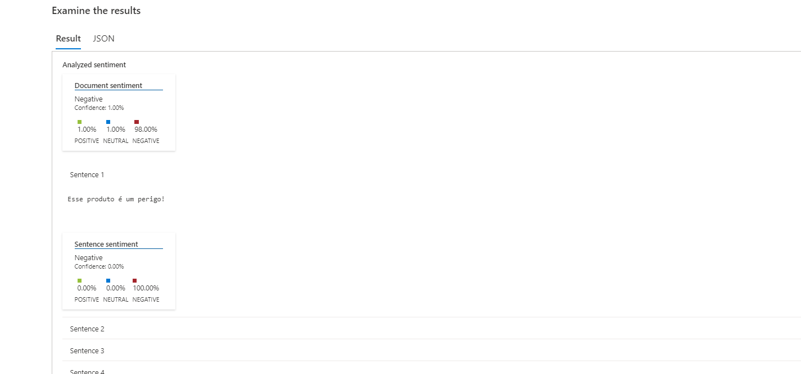
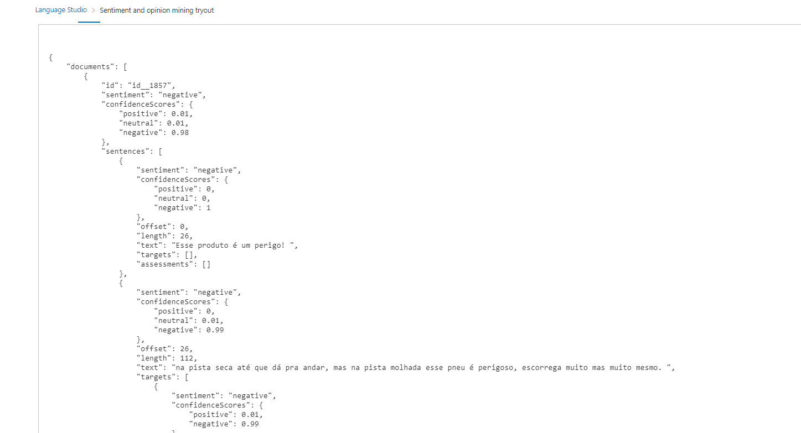

## Testes Práticos no Language Studio

Exploramos diversas funcionalidades dessa poderosa ferramenta, focando especialmente na transcrição de áudio para texto e na análise de sentimentos para avaliar a positividade ou negatividade de uma mensagem.

Os testes realizados incluíram:

### 1. Teste Positivo:

Foi notável a capacidade de selecionar o idioma desejado para a transcrição do texto.

Resultado obtido:

A inteligência artificial analisou pontos-chave na sentença, fragmentando a análise para determinar se o texto possui uma conotação positiva ou negativa.

### 2. Teste Negativo:

Resultado obtido:

Mesmo com um texto mais extenso, a IA conseguiu isolar palavras-chave eficientemente, revelando a polaridade do conteúdo.

Observação Importante: Em todos os exemplos, a ferramenta oferece a opção de exportar os resultados em um arquivo JSON, facilitando a integração com aplicações externas.

Esses testes evidenciam a versatilidade e eficácia da ferramenta, proporcionando uma valiosa análise de sentimentos em diversos contextos, com a praticidade de exportar os resultados para posterior uso em outras aplicações.